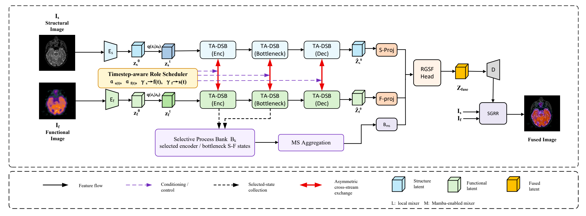
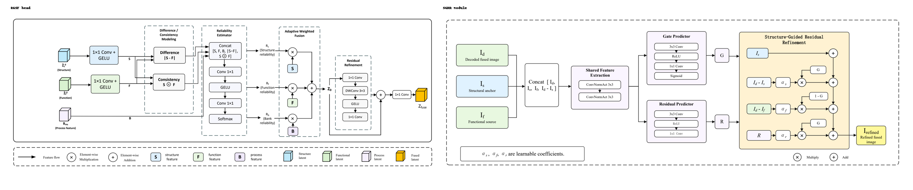
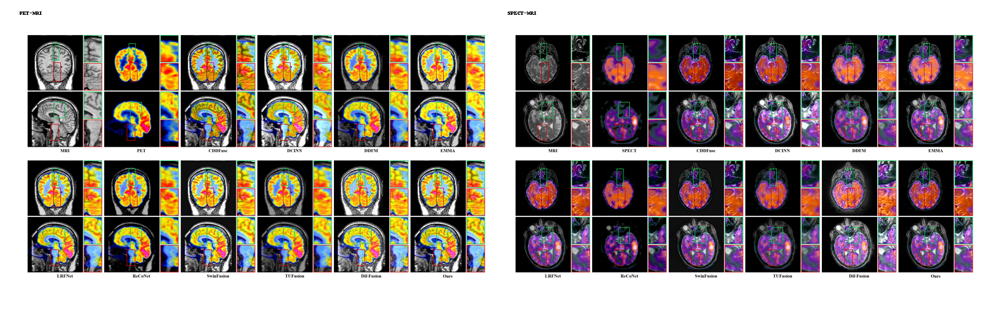

# DSDFuse

Official implementation of **DSDFuse: Dual-Stream Structure-Function Diffusion Fusion Network for Functional-Structural Medical Image Fusion**.

DSDFuse is a latent diffusion framework for functional-structural medical image fusion. It keeps structural and functional latent streams separated during reverse denoising, reuses selected diffusion-process features, and refines the decoded result with structure-guided reliability correction.



## News

- **2026-07:** Initial public code release is being prepared.
- Pretrained checkpoints and paper link will be added after release.

## Contents

- [Highlights](#highlights)
- [Method Overview](#method-overview)
- [Quick Start](#quick-start)
- [Environment](#environment)
- [Dataset Layout](#dataset-layout)
- [Training](#training)
- [Testing](#testing)
- [Ablation Experiments](#ablation-experiments)
- [Metrics](#metrics)
- [FAQ](#faq)
- [Citation](#citation)

## Highlights

- **Dual-stream latent diffusion:** structural and functional latents are denoised in separate but collaborative streams.
- **Timestep-aware denoising backbone:** local and Mamba-enabled context mixers are arranged for shallow-to-deep reconstruction stages.
- **Selective process feature bank:** intermediate encoder and bottleneck denoising states are reused as process evidence.
- **Reliability-guided fusion head:** structural, functional, and process-bank features are adaptively weighted in latent space.
- **Structure-guided refinement:** the decoded fused image is corrected with a lightweight image-domain reliability gate.

## Method Overview

DSDFuse contains four main components:

| Component | File | Description |
| --- | --- | --- |
| Latent encoder/decoder | `model/diffusers/UNet_arch.py` | Encodes paired source images into compact latent features and decodes the fused latent. |
| Dual-stream denoising backbone | `model/head/dsdfuse_backbone.py` | Performs timestep-conditioned collaborative denoising while preserving structure/function streams. |
| DSDFuse blocks | `model/head/dsdfuse_blocks.py` | Implements local mixers, Mamba mixers, cross-stream exchange, role scheduling, and process-bank collection. |
| RGSF fusion head | `model/head/dsdfuse_head.py` | Aggregates process features and predicts reliability maps for structure, function, and bank evidence. |
| Fusion pipeline | `model/head/fusion_pipeline.py` | Connects encoding, diffusion sampling, latent fusion, decoding, refinement, and losses. |

Additional module figures:



## Quick Start

1. Create the environment:

```bash
mamba env create -f environment.yml
mamba activate mamba
pip install mamba-ssm
```

2. Prepare paired images under `dataset/` following the layout below.

3. Run PET-MRI inference with a checkpoint:

```bash
python -u test-med-PET.py \
  -c config/test_pet_mri.json \
  --resume_state path/to/best_gen_G.pth \
  --max_images 2
```

4. Train the PET-MRI model:

```bash
python -u train.py -c config/train_pet_mri_dsdfuse.json
```

## Repository Structure

```text
DSDFuse/
  assets/                  # README figures
  config/                  # training, testing, and ablation configs
  core/                    # logging and metric utilities
  data/                    # paired medical-image dataset loader
  model/
    diffusers/             # local latent encoder/decoder and schedulers
    head/                  # DSDFuse backbone, blocks, fusion head, pipeline
    loss/                  # fusion and SSIM losses
  scripts/                 # ablation launch and summary scripts
  tools/                   # figure drawing utilities
  train.py                 # training entry point
  test-med-PET.py          # PET-MRI testing and metrics
  test-med-SPECT.py        # SPECT-MRI testing and metrics
  test-med-CT.py           # extra CT-MRI testing setting
```

## Environment

Recommended environment:

| Item | Version |
| --- | --- |
| Python | 3.10 |
| PyTorch | CUDA build matching your GPU driver |
| CUDA | 11.8 or 12.x tested depending on PyTorch build |
| Main extras | `opencv-python`, `scikit-image`, `sewar`, `einops`, `mamba-ssm` |

Create the environment from the provided file:

```bash
mamba env create -f environment.yml
mamba activate mamba
```

Or install the dependencies manually:

```bash
pip install torch torchvision --index-url https://download.pytorch.org/whl/cu121
pip install -r requirements.txt
```

### Mamba Dependency

The paper model uses `mamba-ssm` for Mamba-enabled context mixing:

```bash
pip install mamba-ssm
```

If `mamba-ssm` is unavailable, the code falls back to a lightweight local sequence mixer so that debugging and CPU smoke tests can still run. This fallback is for development only; install `mamba-ssm` to reproduce the paper model.

## Dataset Layout

Place registered medical image pairs under `dataset/`:

```text
dataset/
  train/
    Med/
      PET-MRI/
        MRI/
        PET/
      SPECT-MRI/
        MRI/
        SPECT/
      CT-MRI/
        MRI/
        CT/
  test/
    Med/
      PET-MRI/
        MRI/
        PET/
      SPECT-MRI/
        MRI/
        SPECT/
      CT-MRI/
        MRI/
        CT/
```

Files with the same filename in the two modality folders are treated as paired inputs. Large datasets are not included in this repository.

The paper experiments use registered PET-MRI and SPECT-MRI image pairs derived from a public brain atlas. To reproduce the reported numbers, use the same processed split and preprocessing protocol as the paper.

## Training

PET-MRI:

```bash
python -u train.py -c config/train_pet_mri_dsdfuse.json
```

SPECT-MRI:

```bash
python -u train.py -c config/train_spect_mri_full_tuned.json
```

Useful debugging options:

```bash
python -u train.py -c config/train_pet_mri_dsdfuse.json --batch_size 4
python -u train.py -c config/train_pet_mri_dsdfuse.json --max_steps 10
```

## Testing

Testing scripts save fused images and metric CSV files. A checkpoint can be specified either in the config file or with `--resume_state`; the command-line argument has priority.

PET-MRI:

```bash
python -u test-med-PET.py -c config/test_pet_mri.json --resume_state experiments/your_exp/checkpoint/best_gen_G.pth
```

SPECT-MRI:

```bash
python -u test-med-SPECT.py -c config/test_spect_mri.json --resume_state experiments/your_exp/checkpoint/best_gen_G.pth
```

CT-MRI is kept as an extra experimental setting:

```bash
python -u test-med-CT.py -c config/test_ct_mri.json --resume_state experiments/your_exp/checkpoint/best_gen_G.pth
```

For a quick PET-MRI check:

```bash
python -u test-med-PET.py -c config/test_pet_mri.json --resume_state path/to/checkpoint.pth --max_images 2
```

## Ablation Experiments

Ablation configs are provided under `config/` for PET-MRI and SPECT-MRI:

- `baseline`
- `wo_backbone`
- `wo_bank`
- `wo_fusion_head`
- `wo_mamba`
- `wo_refinement`
- `full`

Example:

```bash
python -u train.py -c config/train_pet_mri_ablation_full.json
```

The scripts in `scripts/` can launch ablation runs and summarize results.

```bash
bash scripts/run_ablation_pet.sh
bash scripts/run_ablation_spect.sh
```

PowerShell versions are also provided for Windows users.

## Qualitative Examples



## Metrics

Testing scripts report common image-fusion metrics and save CSV summaries in the output folder, including:

- MI
- VIF
- QAB/F
- SSIM
- NCIE
- FMI_pixel

Use the paper checkpoint, matching config, and the same processed PET-MRI or SPECT-MRI split to reproduce the reported tables.

## Outputs

Training outputs are written to `experiments/` by default. Testing outputs are written under `dataset/test_result/` unless `--output_dir` is supplied.

The following generated files are ignored by Git:

- datasets
- checkpoints and weights
- logs
- TensorBoard folders
- generated fusion results

## Checkpoints

Pretrained checkpoints will be released separately. Place downloaded checkpoints outside the repository or under an ignored output directory such as `experiments/`.

| Setting | Config | Checkpoint |
| --- | --- | --- |
| PET-MRI | `config/test_pet_mri.json` | Coming soon |
| SPECT-MRI | `config/test_spect_mri.json` | Coming soon |
| CT-MRI extra setting | `config/test_ct_mri.json` | Coming soon |

## FAQ

**Do I need `mamba-ssm`?**  
Yes for reproducing the paper model. Without `mamba-ssm`, the code uses a local fallback mixer for debugging and smoke tests.

**Why are datasets and checkpoints not included?**  
Medical image datasets and trained weights can be large and may have redistribution constraints. The repository keeps code, configs, and evaluation scripts; data and checkpoints should be placed locally.

**Can I run the code on CPU?**  
Small smoke tests can run on CPU, but training and full diffusion inference are intended for CUDA GPUs.

**Which modality is structural and which is functional?**  
For PET-MRI and SPECT-MRI, MRI is used as the structural image, while PET or SPECT is used as the functional image.

**Where are outputs saved?**  
Training outputs are saved under `experiments/` by default. Testing outputs are saved under `dataset/test_result/` unless `--output_dir` is provided.

## Citation

If this code is useful for your research, please cite:

```bibtex
@article{liu2026dsdfuse,
  title={DSDFuse: Dual-Stream Structure-Function Diffusion Fusion Network for Functional-Structural Medical Image Fusion},
  author={Liu, Xueping and Song, Zhaolin and Li, Lanting and Li, Na and Ding, Silu},
  journal={Preprint},
  year={2026}
}
```

## Acknowledgement

Parts of the local diffusion scheduler code are adapted from open-source diffusion implementations. See inline comments in `model/diffusers/` for details.
