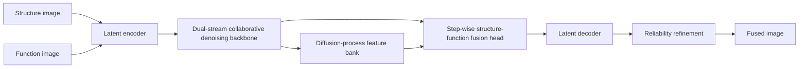

# DSDFuse

Official implementation of **DSDFuse**, a dual-stream collaborative diffusion network for medical image fusion.

DSDFuse encodes structural and functional medical images into latent streams, performs dual-stream denoising with Mamba-enhanced restoration blocks, accumulates a selective diffusion-process feature bank, and decodes a fused image with structure-guided reliability refinement.

## News

- This repository contains the current DSDFuse model code for PET-MRI and SPECT-MRI fusion experiments. CT-MRI configs are included as an extra experimental setting.
- Pretrained checkpoints and paper links can be added here after release.

## Paper

Use the following sentence after the abstract:

> Code is available at: [https://github.com/MEAI-SAU/DSDFuse](https://github.com/MEAI-SAU/DSDFuse)

## Method Overview



Main modules:

- `model/head/dsdfuse_backbone.py`: dual-stream denoising backbone.
- `model/head/dsdfuse_blocks.py`: local convolution and Mamba restoration blocks.
- `model/head/dsdfuse_head.py`: step-wise structure-function fusion and reliability refinement.
- `model/head/fusion_pipeline.py`: end-to-end diffusion fusion pipeline.
- `model/networks.py`: model construction.

## Environment

The project was organized for a Conda/Mamba environment. A typical setup is:

```bash
mamba env create -f environment.yml
mamba activate mamba
```

Or install into an existing environment:

```bash
pip install -r requirements.txt
```

For GPU training, install the PyTorch build that matches your CUDA version before installing the remaining packages. For example:

```bash
pip install torch torchvision --index-url https://download.pytorch.org/whl/cu121
pip install -r requirements.txt
```

### Mamba Dependency

The model uses `mamba-ssm` when it is available:

```bash
pip install mamba-ssm
```

If `mamba-ssm` is not installed, the code falls back to a lightweight local sequence mixer so that debugging and CPU smoke tests can still run. For reproducing the paper model, install `mamba-ssm`.

The fallback path is intended for development only. Use the same CUDA, PyTorch, and `mamba-ssm` stack when reproducing the paper results.

## Dataset Layout

Place medical image pairs under `dataset/` with the following structure:

```text
dataset/
  train/
    Med/
      PET-MRI/
        MRI/
        PET/
      SPECT-MRI/
        MRI/
        SPECT/
      CT-MRI/
        MRI/
        CT/
  test/
    Med/
      PET-MRI/
        MRI/
        PET/
      SPECT-MRI/
        MRI/
        SPECT/
      CT-MRI/
        MRI/
        CT/
```

Files with the same name in the two modality folders are treated as paired inputs.

Large datasets are intentionally excluded from Git. Put download links or preparation instructions here if the dataset can be redistributed.

## Training

PET-MRI main configuration:

```bash
python -u train.py -c config/train_pet_mri_dsdfuse.json
```

Useful options:

```bash
python -u train.py -c config/train_pet_mri_dsdfuse.json --batch_size 4
python -u train.py -c config/train_pet_mri_dsdfuse.json --max_steps 10
```

`--max_steps` is useful for smoke tests before launching long training.

## Testing

PET-MRI:

```bash
python -u test-med-PET.py -c config/test_pet_mri.json --resume_state experiments/your_exp/checkpoint/best_gen_G.pth
```

SPECT-MRI:

```bash
python -u test-med-SPECT.py -c config/test_spect_mri.json --resume_state experiments/your_exp/checkpoint/best_gen_G.pth
```

CT-MRI:

```bash
python -u test-med-CT.py -c config/test_ct_mri.json --resume_state experiments/your_exp/checkpoint/best_gen_G.pth
```

For a quick check:

```bash
python -u test-med-PET.py -c config/test_pet_mri.json --resume_state path/to/checkpoint.pth --max_images 2
```

## Configs

Canonical configs:

- `config/train_pet_mri_dsdfuse.json`
- `config/test_pet_mri.json`
- `config/test_spect_mri.json`
- `config/test_ct_mri.json`

Ablation configs are kept under `config/` and can be launched directly with the same training and testing entry points.

## Outputs

Training outputs are written to `experiments/` by default. Testing outputs are written under `dataset/test_result/` unless `--output_dir` is supplied.

These generated files are ignored by Git:

- datasets
- checkpoints and weights
- logs
- tensorboard folders
- generated fusion results

## Reproducing Metrics

Testing scripts write per-image metrics and summary CSV files in the selected output folder. Use the paper checkpoint, matching config, and the same processed PET-MRI or SPECT-MRI split to reproduce the reported tables.

## Citation

Please cite the paper if this code is helpful:

```bibtex
@article{DSDFuse,
  title={DSDFuse: Dual-Stream Collaborative Diffusion for Medical Image Fusion},
  author={TODO},
  journal={TODO},
  year={TODO}
}
```

## Acknowledgement

Parts of the local diffusion scheduler code are adapted from open-source diffusion implementations. See inline comments in `model/diffusers/` for the corresponding references.
